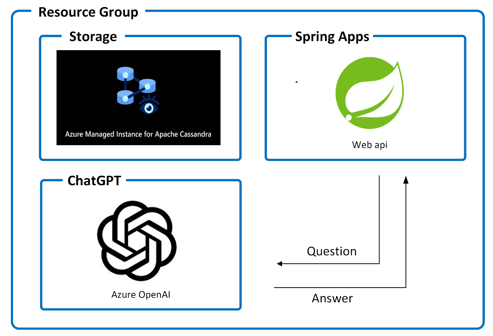
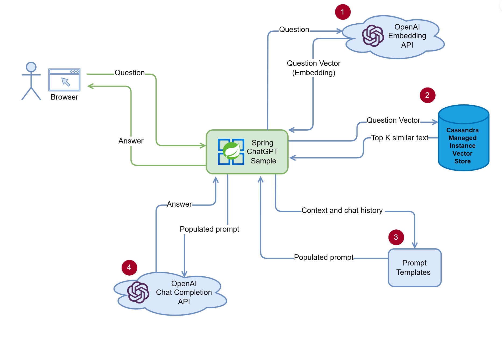

# ChatGPT Sample with Azure Managed Instance for Apache Cassandra as Vector Store

This sample shows how to build a ChatGPT like application in Spring using Azure OpenAI and Azure Managed Instance for Apache Cassandra (version 5.0) as a vector store. This enables OpenAI to use your private data to answer the questions.

### Application Architecture

This application utilizes the following Azure resources:

- Java Spring Boot Framework to host the application
- [**Azure OpenAI**](https://docs.microsoft.com/azure/cognitive-services/openai/) for ChatGPT
- [**Azure Managed Instance for Apache Cassandra**](https://aka.ms/CassandraMIVectorStore) as the vector store database.

Here's a high level architecture diagram that illustrates these components.



## How it works



1. Indexing flow (CLI)
   1. Load private documents from your local disk.
   1. Split the text into chunks.
   1. Convert text chunks into embeddings
   1. Save the embeddings into the Cassandra v5.0 Vector Store
1. Query flow (Web API)
   1. Convert the user's query text to an embedding.
   1. Query Top-K nearest text chunks from the Cassandra 5.0 vector store (by cosine similarity).
   1. Populate the prompt template with the chunks.
   1. Call to OpenAI text completion API.


## Getting Started

### Prerequisites

The following prerequisites are required to use this application. Please ensure that you have them all installed locally.

- [Git](http://git-scm.com/).
- [Java 17 or later](https://learn.microsoft.com/java/openjdk/install)
- [Azure Managed Instance for Apache Cassandra](https://learn.microsoft.com/azure/managed-instance-apache-cassandra/). **NOTE**: you must select Cassandra version 5.0 for vector search support.
- An Azure OpenAI account (see more [here](https://customervoice.microsoft.com/Pages/ResponsePage.aspx?id=v4j5cvGGr0GRqy180BHbR7en2Ais5pxKtso_Pz4b1_xUOFA5Qk1UWDRBMjg0WFhPMkIzTzhKQ1dWNyQlQCN0PWcu))

### Quickstart

1. git clone this repo.
2. Create the following `environment variables` with the appropriate values:

   ```shell
   set AZURE_OPENAI_EMBEDDINGDEPLOYMENTID=<Your OpenAI embedding deployment id>
   set AZURE_OPENAI_CHATDEPLOYMENTID=<Your Azure OpenAI chat deployment id>
   set AZURE_OPENAI_ENDPOINT=<Your Azure OpenAI endpoint>
   set AZURE_OPENAI_APIKEY=<Your Azure OpenAI API key>
   set CASSANDRA_USERNAME=<Your Cassandra username>
   set CASSANDRA_PASSWORD=<Your Cassandra password>
   set CASSANDRA_CONTACT_POINT=<IP Address from one node in your Cassandra Managed Instance cluster>
   set CASSANDRA_DATACENTER=<datacenter name from your Cassandra Managed Instance cluster>
   ```
   NOTE: The `CASSANDRA_CONTACT_POINT` variable should include the port, e.g.: `10.41.1.11:9042`

   If you are using Windows PowerShell, set the environment variables like the following:

   ```shell
   $env:AZURE_OPENAI_EMBEDDINGDEPLOYMENTID="<Your OpenAI embedding deployment id>"
   $env:AZURE_OPENAI_CHATDEPLOYMENTID="<Your Azure OpenAI chat deployment id>"
   $env:AZURE_OPENAI_ENDPOINT="<Your Azure OpenAI endpoint>"
   $env:AZURE_OPENAI_APIKEY="<Your Azure OpenAI API key>"
   $env:CASSANDRA_USERNAME="<Your Cassandra username>"
   $env:CASSANDRA_PASSWORD="<Your Cassandra password>"
   $env:CASSANDRA_CONTACT_POINT="<IP Address from one node in your Cassandra Managed Instance cluster>"
   $env:CASSANDRA_DATACENTER="<datacenter name from your Cassandra Managed Instance cluster>"
   ```


3. Build the application:

   ```shell
   mvn clean package
   ```  

4. The following command will read and process your own private text documents, create a Cassandra 5.0 keyspace and table with vector index, and load the processed documents into it:

   ```shell
      java -jar spring-chatgpt-sample-cli/target/spring-chatgpt-sample-cli-0.0.1-SNAPSHOT.jar --from=C:/<path you your private text docs>

   ```
   > Note: if you don't run the above to process your own documents, at first startup the application will read a pre-provided and pre-processed `vector-store.json` file in `private-data` folder, and load those documents into Cassandra instead.

5. Run the following command to build and run the application:

   ```shell
   java -jar spring-chatgpt-sample-webapi/target/spring-chatgpt-sample-webapi-0.0.1-SNAPSHOT.jar
   ```
6. Open your browser and navigate to `http://localhost:8080/`. You should see the below page. Test it out by typing in a question and clicking `Send`.

   

   <sup>Screenshot of the deployed chatgpt app</sup>